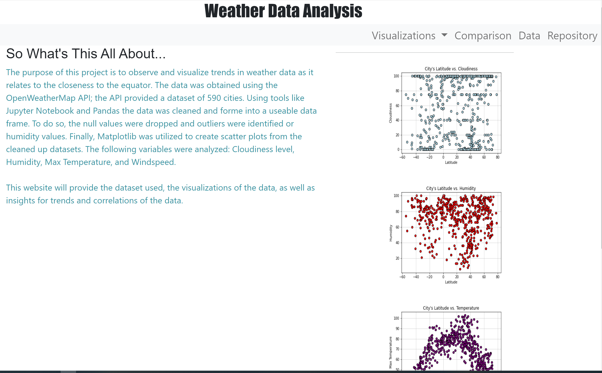

# Web-Design-Challenge: Weather Analysis and Visualization

## Background
#### Data is more powerful when we share it with others! I will be using what we've learned about HTML and CSS to create a dashboard featuring the analysis for weather data.
 

#### Below is the main page rendering of the Visualizations:

#### This page has several components to visualize the data
1) Navigation on the top right corner
2) 4 graph panels on the ride side of the screen

 

## Navigation
- Visualizations - provides a drop down to navigate to each analysis criteria, which includes both a graph and the explanation for the graph
- Comparisons - allows to visualize the graphs in one view
- Data - provides a table of the raw data that was analyzed
- Repository - provides a link to this repo to view the code

## Panels
- Provide yet another visualization and a way to navigate to further analysis of the graphs

#
#### Below is the url to navigate to the website:
https://sravitham.github.io/Web-Design-Challenge/

